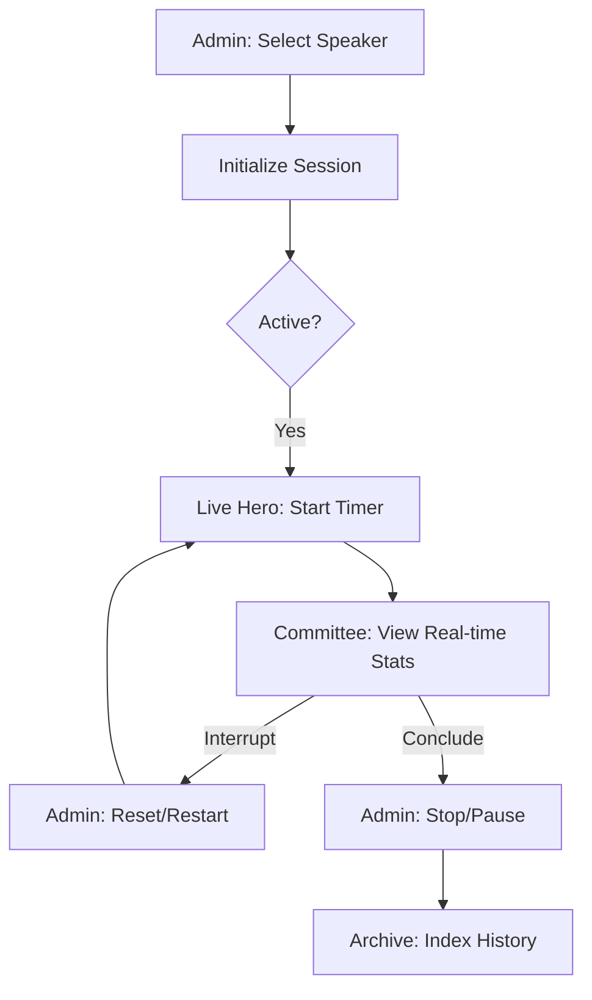
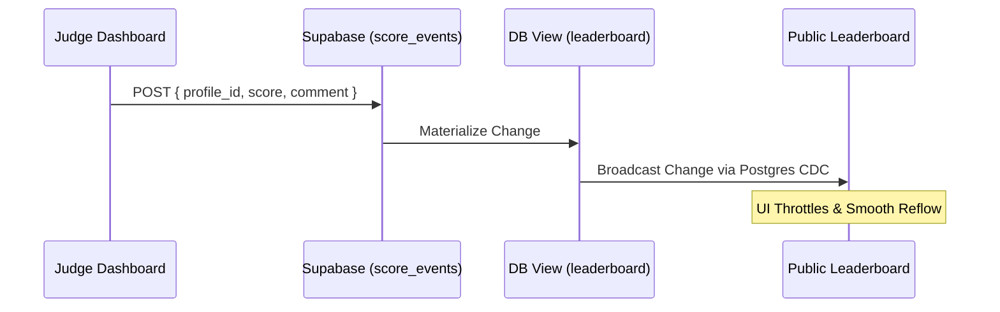

# THE ARCHIVE // STEM-MUN OPERATING SYSTEM
**Performance Analytics & Real-Time Scoring for STEM-MUN 1.0 (Concordia/APOGEE)**

---

## 1. Executive Summary
THE ARCHIVE is a high-performance governance and scoring platform designed for STEM-MUN 1.0, conducted by APOGEE in association with QMania and E-Cell NIT Jalandhar. The system transitions MUN adjudication from static scoring to a dynamic, event-driven intelligence protocol, providing real-time floor control, automated analytics, and high-fidelity visibility for delegates and arbiters.

---

## 2. Platform Architecture
The system is built on a "Real-time Truth" principle, where every score input is an immutable event synchronized across all committee participants in under 100ms.

### 2.1 Technical Specifications
- **Framework**: Next.js 16.2.1 (App Router) with Turbopack acceleration.
- **Styling**: Tailwind CSS v4 with a centralized "Luxury Industrial" typography and color token system.
- **Database/Realtime**: Supabase (PostgreSQL) leveraging Row Level Security (RLS) and Postgres CDC for live synchronization.
- **Motion**: Framer Motion with spring-based interpolation for institutional UI responsiveness.

---

## 3. Operational Workflows

### 3.1 Speaker Session Lifecycle
The "Archive Protocol" governs floor ownership through a strict state machine.



### 3.2 Scoring Pipeline (Event-Driven)
Scores are processed as atomic events to ensure auditability and prevent data race conditions.



---

## 4. Design System: THE ARCHIVE Aesthetic
The platform adheres to a "Monolithic Professionalism" design philosophy.

### 4.1 Color Architecture (HSL Restricted)
| Token | Hex | Usage |
| :--- | :--- | :--- |
| **Background** | `#000000` | Pure terminal depth |
| **Surface** | `#0F0F0F` | Primary card elevations |
| **Text-Primary** | `#FFFFFF` | High-fidelity readability |
| **Text-Secondary** | `#A1A1A1` | Metadata & system intel |
| **Accent-Green** | `#4DE082` | Live state validation only |

### 4.2 Typography Hierarchy
- **Hero Display**: Outfit (Bold Italic), aggressive tracking.
- **Functional UI**: Inter (Regular/Medium), optimized for data density.
- **System Intel**: JetBrains Mono (Medium), for raw telemetry and logs.

---

## 5. Security & Governance Protocols
- **Arbiter Access**: Secured via Supabase Auth with custom `role` checks in middleware.
- **Floor Protection**: Session timers are calculated server-side based on the `speaker_started_at` anchor, ensuring that network latency does not affect the official floor duration.
- **Halt Signal**: An administrative override that broadcasts an immediate visual stop-command across all committee screens.

---

## 6. Implementation & Deployment

### 6.1 Prerequisites
- Node.js 18.x or higher.
- Supabase Project with `pg_net` and `postgis` (optional but recommended).

### 6.2 Installation
```bash
# 01. Clone the repository
git clone https://github.com/vatsalkhanna/stem-mun.git

# 02. Install institutional dependencies
npm install

# 03. Configure Uplink (.env.local)
NEXT_PUBLIC_SUPABASE_URL=YOUR_INSTANCE_URL
NEXT_PUBLIC_SUPABASE_ANON_KEY=YOUR_SERVICE_KEY

# 04. Boot System
npm run dev
```

### 6.3 Database Initialization
The `leaderboard` view must be materialized to handle real-time aggregations:

```sql
CREATE VIEW leaderboard AS
SELECT 
    p.id as profile_id,
    p.name,
    p.image_url,
    p.committee,
    SUM(se.score) as total_score
FROM profiles p
JOIN score_events se ON se.profile_id = p.id
GROUP BY p.id;
```

---

## 7. Performance Benchmarks
- **Sync Latency**: <120ms (Realtime postgres channel).
- **Lighthouse Performance**: 95+ (Next.js Image + Turbopack).
- **Security Audit**: RLS verified for public vs. arbiter data visibility.

---

**Developed for STEM-MUN // APOGEE // NIT JALANDHAR**
*Archive Protocol Engaged.*
